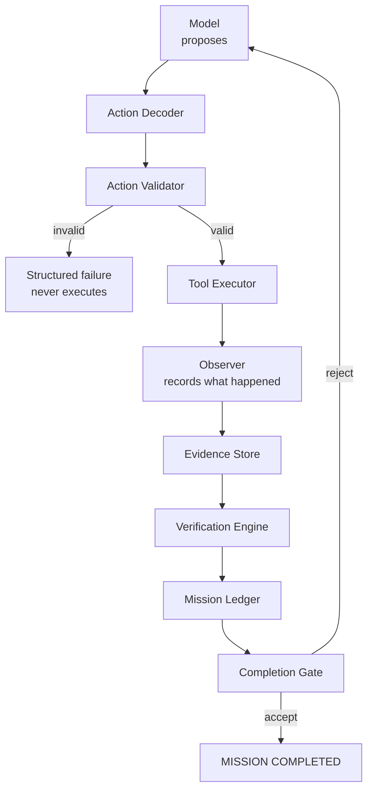
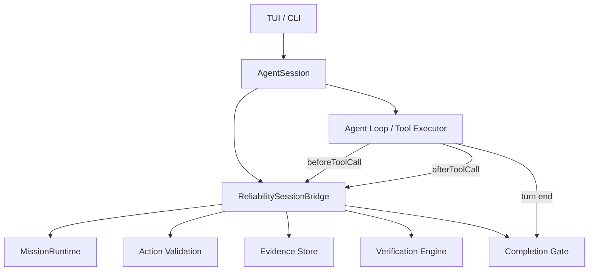

# Reliable Agent Runtime

Jensen 2.1.0 introduces the **Reliability Kernel**: a deterministic execution
and verification layer that moves execution authority from the model into
Jensen.

> **The model proposes completion. Jensen verifies completion.**

This document describes the architecture, authority model, and extension points.

## Architecture



### Production wiring (2.2.0)

In 2.2.0 the kernel is authoritative in the real interactive runtime. There is
no separate "normal Jensen" versus "Jensen with the Reliability Kernel" path:



The model proposes actions and may propose finalization; Jensen owns tool
authorization, mission state, evidence, verification, criterion state, and
completion.

## Authority model

| Actor | Authority |
|-------|-----------|
| Model | Proposes actions, proposes `FINAL_CANDIDATE`, proposes reasoning |
| Jensen | Decodes output, validates actions, executes tools, records evidence, verifies acceptance criteria, decides completion |

The model cannot unilaterally change task state, mark a criterion passed, mark a
mission complete, bypass the tool registry, bypass schema validation, or bypass
boundary/permission checks. A model assertion ("Done.") never marks a criterion
passed — criterion state changes require Jensen-side evidence.

## Mission Ledger

A mission is a durable, machine-readable, session-associated representation of:

- the goal;
- constraints and forbidden actions;
- acceptance criteria (user-required vs system-derived);
- criterion status (derived from evidence, not model claims);
- evidence references;
- active blockers;
- touched resources.

The Mission Ledger survives process exit, `jensen resume <SESSION_ID>`, and
context compaction. It reuses the Long-Horizon Mission Contract and Requirement
Ledger subsystem (`src/core/long-horizon`) for durable, digest-bound,
append-only state.

## Agent Actions

Model output is normalized into a finite, Jensen-owned `AgentAction` union:

- `tool_call`
- `request_context`
- `mission_update`
- `final_candidate`
- `blocked`
- `no_op`

`final_candidate` is a *proposal*, not a completion. Only the Completion Gate
may transition the mission to COMPLETED.

## Action Validation

Every executable action is validated before execution:

1. action type recognized;
2. tool exists in the registry;
3. arguments parse and satisfy the tool schema;
4. required arguments present and correctly typed;
5. boundary constraints respected;
6. permission/effect policy respected;
7. mission-forbidden actions rejected.

A validation failure returns a structured `ActionValidationFailure` (category,
message, recoverable) and the tool is **not executed**. This is the foundation
for the future Recovery Engine.

## Evidence Store

Evidence is a normalized record of something Jensen actually observed (command,
exit code, important result, supported criterion), never a model assertion.
Deterministic verification evidence is recorded under a Jensen-held trusted
context, so it is authoritative — the model's untrusted context can only produce
non-authoritative "agent claims".

## Verification Engine

Deterministic, extensible verification operations include:

- command / test / build / lint / typecheck succeed (exit code 0);
- file exists / absent / contains expected structure;
- repository search confirms no stale references;
- git diff respects scope.

Where verification can be deterministic, deterministic evidence is preferred over
model self-review.

## Completion Gate

```text
MODEL → FINAL_CANDIDATE
              │
              ▼
       COMPLETION GATE
              │
      ┌───────┴───────┐
      │               │
    ACCEPT          REJECT
      │               │
  COMPLETED     continue mission
```

Completion requires all required acceptance criteria to be satisfied with
authoritative evidence, no active fatal blocker, and required final validation
evidence present. A missing criterion produces:

```text
FINALIZATION_REJECTED

Unverified acceptance criteria:
- AC-03: regression suite passes
- AC-05: package Z remains unchanged
```

## Session / resume behavior

The Mission Ledger is embedded in session-associated durable state as an
additive `session_reliability` session entry. On `jensen resume <SESSION_ID>`,
Jensen restores the goal, constraints, criteria, criterion status, execution
state, and evidence references from the persisted document — without restarting
from zero and without asking the model to re-derive them. The session ID and
mission ID both stay stable across resume. Old sessions without a Mission
Ledger remain valid and are not treated as corrupted; they initialize the
Reliability Kernel in governance mode.

## Lifecycle

```text
session
  → mission (created on task start, restored on resume)
  → action (model proposes)
  → validation (Jensen authorizes or blocks)
  → execution (real tool runs)
  → evidence (Jensen records the observed outcome)
  → verification (deterministic checks for acceptance criteria)
  → completion (Completion Gate accepts or rejects)
  → persistence (mission state appended to the session)
  → resume (mission state restored on `jensen resume <SESSION_ID>`)
```

A mission represents the durable user task/work unit; it is not recreated for
every assistant turn.

## Turn end vs mission end

These are distinct. An assistant turn ends whenever the model stops requesting
tool calls. The mission ends only when the Completion Gate accepts
finalization. A model may print "Done." while required acceptance criteria
remain unsatisfied; Jensen rejects that finalization and returns a structured
`FINALIZATION_REJECTED` message so the model can continue. Rejections are
bounded to prevent infinite loops.

## Local-model behavior

The Reliability Kernel is provider-independent. Where a backend provides native
tools or constrained structured output, the strongest supported path is used;
otherwise the validated parser/decoder fallback is used. Free-form output is
never trusted directly. There are no model-specific branches in the runtime;
capability information is isolated for the future Model Profiler.

## Failure taxonomy

Failures become structured events: `ACTION_DECODE_FAILURE`,
`ACTION_VALIDATION_FAILURE`, `TOOL_EXECUTION_FAILURE`, `VERIFICATION_FAILURE`,
`CONTEXT_REQUIRED`, `BOUNDARY_VIOLATION`, `PERMISSION_FAILURE`,
`FINALIZATION_REJECTED`, `INTERNAL_RUNTIME_FAILURE`.

Any bounded repair loop has an explicit maximum attempt count and observable
failure.

## Telemetry

Key events are recorded for the Reliability Benchmark: mission started, action
proposed, decode/validation failure, tool executed/failed, evidence recorded,
verification executed, criterion passed/failed, finalization proposed/rejected,
mission completed/blocked.

## Reliability Suite

Deterministic adversarial scenarios (`packages/coding-agent/test/reliability/`)
prove that the trusted runtime stays safe when the model misbehaves:

- R01 exact single-file edit
- R02 multi-file change
- R03 failing-test diagnosis
- R04 malformed tool/action response
- R05 nonexistent file hallucination
- R06 premature "done" claim
- R07 forgotten acceptance criterion
- R08 tool execution failure
- R09 compaction continuity
- R10 process exit + resume
- R11 wrong-session protection
- R12 boundary violation
- R13 regression verification
- R14 dirty working tree preservation
- R15 finalization rejection

### Activation suite (2.2.0)

Integration scenarios that drive the REAL `AgentSession` / agent loop with a
scripted fake model:

- A01 live `beforeToolCall` validation
- A02 live `afterToolCall` evidence
- A03 live finalization rejection
- A04 live finalization pass
- A05 session mission persistence
- A06 explicit resume restores mission
- A07 compaction preserves mission
- A08 old session loads without reliability state
- A09 boundary prevents real execution
- A10 adversarial fake model through the production loop

## Future extension points

- **Recovery Engine (2.2.1):** consumes the structured failure taxonomy and
  `ActionValidationFailure.recoverable` flag for bounded, observable repair
  (stagnation recovery, multi-strategy retry, model escalation).
- **Model Profiler (2.2.2):** populates the capability abstraction used to select
  the strongest decoding route.
- **Context Engine:** retrieves only the evidence references it needs rather than
  the full history.
